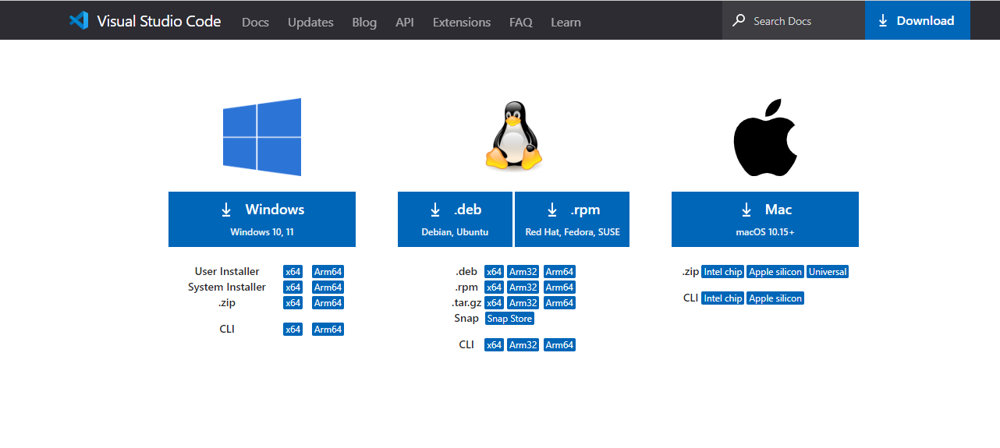

# Dev_Setup

Setup Development Environment

#Assignment: Setting Up Your Developer Environment

#Objective:
This assignment aims to familiarize you with the tools and configurations necessary to set up an efficient developer environment for software engineering projects. Completing this assignment will give you the skills required to set up a robust and productive workspace conducive to coding, debugging, version control, and collaboration.

#Tasks:

1. Select Your Operating System (OS):
   Choose an operating system that best suits your preferences and project requirements. Download and Install Windows 11. https://www.microsoft.com/software-download/windows11

   Chosen Operating System: Windows 10 Pro
   Reason for Selection:
   Due to hardware limitations, my Lenovo G40 laptop does not meet the requirements for installing Windows 11, specifically the absence of TPM 2.0. Therefore, I will use Windows 10 Pro, which is already installed on my system. Windows 10 Pro provides a stable and well-supported environment for software development and meets all the necessary requirements for this assignment.

   System Information:
   Device Name: DESKTOP-I34F1B8
   Processor: Intel(R) Core(TM) i5-4210U CPU @ 1.70GHz 2.40 GHz
   Installed RAM: 4.00 GB (3.90 GB usable)
   System Type: 64-bit operating system, x64-based processor
   Operating System: Windows 10 Pro

2. Install a Text Editor or Integrated Development Environment (IDE):
   Select and install a text editor or IDE suitable for your programming languages and workflow. Download and Install Visual Studio Code. https://code.visualstudio.com/Download
   Installation Steps:

   Download VS Code:
   -I navigated to the Visual Studio Code download page[ https://code.visualstudio.com/Download]
   -I selected the appropriate version for my operating system and clicked the download link.
   
   Install VS Code:
   -I located the downloaded installer file (e.g., VSCodeSetup.exe) and double-clicked to run it.
   -I followed the installation wizard instructions to complete the installation.
   Launch VS Code:
   -Once installed, I opened Visual Studio Code by searching for "Visual Studio Code" in the Start menu and clicking on the application.
   

3. Set Up Version Control System:
   Install Git and configure it on your local machine. Create a GitHub account for hosting your repositories. Initialize a Git repository for your project and make your first commit. https://github.com

   Install Git
   I downloaded Git from the official website at Git Downloads.
   
   I ran the installer and followed the installation steps, using the default settings.

   Configure Git:
   I opened Git Bash on Windows and configured my username and email:
   bash using the following commands
   (git config --global user.name "Your Name"
   git config --global user.email "youremail@example.com)
   

   Create a GitHub Account:
   I went to GitHub and signed up for an account.
   I verified my email address and set up my profile.
   

   Initialize a Git Repository:
   I created a new directory for my project and navigated into it in the terminal.
   I initialized a new Git repository:
   
   

   Create and Edit .gitignore File:
   I created a .gitignore file to specify files and directories that Git should ignore:
   In the .gitignore file, I added patterns for files and directories to ignore:
   
   

   Add Project Files:
   I added my project files to the repository:
   

   Commit Changes:
   I committed my changes:
   
   
   Create a Repository on GitHub:
   Create New Repository:
   I logged in to my GitHub account and clicked on the "+" icon in the top right corner. I selected "New repository" from the dropdown menu. I filled in the details for my new repository, including the repository name and a brief description. I clicked on "Create repository."
   

   Add Remote Repository:
   Copy Repository URL:
   I copied the URL of my GitHub repository (e.g., https://github.com/your-username/your-repository.git).

   Add Remote Repository:
   I added the remote repository to my local Git repository:

   Push Changes to GitHub:
   I pushed my local commits to the remote repository on GitHub:
   

   Verify Repository on GitHub:
   I refreshed my GitHub repository page to see my files and commit history.ory.
   

4. Install Necessary Programming Languages and Runtimes:
   Instal Python from http://wwww.python.org programming language required for your project and install their respective compilers, interpreters, or runtimes. Ensure you have the necessary tools to build and execute your code.
      Download Python:
      I navigated to the official Python website.
      I selected the download link for the latest version of Python suitable for my operating system.
      

      Install Python:
      I located the downloaded installer file (e.g., python-3.x.x.exe) and double-clicked to run it.
      I made sure to check the option "Add Python to PATH" before proceeding with the installation.
      I followed the installation wizard instructions to complete the installation.

      Verify Python Installation:
      I opened the Command Prompt and typed python --version to verify the installation.
      

5. Install Package Managers:
   If applicable, install package managers like pip (Python).
      Verify pip Installation:
      I opened the Command Prompt and typed pip --version to check if pip was installed along with Python.
      Upgrade pip:
      I typed python -m pip install --upgrade pip in the Command Prompt to ensure I had the latest version of pip.
      

6. Configure a Database (MySQL):
   Download and install MySQL database. https://dev.mysql.com/downloads/windows/installer/5.7.html
      a.Download MySQL Database
      I visited the MySQL download page.
      I selected the appropriate installer for my Windows system architecture (32-bit or 64-bit).
      b. Install MySQL Database:
      After downloading the installer, I ran the installer executable (.exe) file.
      I followed the installation wizard steps, choosing the typical installation option unless I had specific requirements.
      c. Configure MySQL:
      During the installation process, I set up the MySQL root user password and noted it down for future reference.
      I selected the option to start the MySQL server as a Windows service, ensuring it starts automatically at system boot.
      d. Complete Installation:
      I completed the installation process, allowing the installer to finish installing MySQL and its components.
      e. Verify Installation:
      To verify that MySQL was installed correctly, I opened a command prompt and typed mysql -V to check the MySQL version.
      Additionally, I opened the MySQL Command Line Client to verify that I could connect to the MySQL server using the root user and the password I set during installation.
7. Set Up Development Environments and Virtualization (Optional):
   Consider using virtualization tools like Docker or virtual machines to isolate project dependencies and ensure consistent environments across different machines.

8. Explore Extensions and Plugins:
   Explore available extensions, plugins, and add-ons for your chosen text editor or IDE to enhance functionality, such as syntax highlighting, linting, code formatting, and version control integration.
      Open Extensions View:
      I opened Visual Studio Code and clicked on the Extensions icon in the Activity Bar on the side of the window (or pressed Ctrl+Shift+X).

      Install Python Extension:
      In the Extensions view, I searched for "Python" and installed the extension provided by Microsoft.

      Install GitLens:
      I searched for "GitLens" and installed the GitLens extension to enhance Git capabilities within VS Code.

      Install Prettier:
      I searched for "Prettier" and installed the Prettier extension for code formatting.
      
9. Document Your Setup:
   Create a comprehensive document outlining the steps you've taken to set up your developer environment. Include any configurations, customizations, or troubleshooting steps encountered during the process.

#Deliverables:

- Document detailing the setup process with step-by-step instructions and screenshots where necessary.
- A GitHub repository containing a sample project initialized with Git and any necessary configuration files (e.g., .gitignore).
      https://github.com/FlastineAhmed/plpassignment1-wk2.git
- A reflection on the challenges faced during setup and strategies employed to overcome them.
      Installing Git and Configuring Git Bash:
      Challenge: Understanding Git terminologies and commands was initially confusing.
      Strategy: I referred to Git documentation and online tutorials to grasp the basics. Using Git Bash helped visualize the command-line operations.
      Creating a GitHub Account and Initializing a Git Repository:

      Challenge: Setting up a new repository on GitHub and linking it to my local Git repository was unfamiliar.
      Strategy: I followed step-by-step guides provided by GitHub and sought help from online forums when encountering difficulties.
      Installing MySQL Database:

      Challenge: Configuring MySQL and ensuring it runs smoothly on Windows was challenging.
      Strategy: I followed the MySQL installation guide carefully, ensuring correct settings and troubleshooting any errors encountered.
      Creating a .gitignore File:

      Challenge: Understanding which files and directories to include in the .gitignore file was tricky.
      Strategy: I used Git's documentation and templates for common .gitignore patterns, customizing it based on my project's requirements.
      Pushing Changes to GitHub:

      Challenge: Pushing changes to GitHub and understanding remote repositories was new to me.
      Strategy: I referred to GitHub's documentation on pushing changes and practiced using remote repositories to gain familiarity.
      Overall, the setup process was a valuable learning experience. While challenging, it provided a solid foundation in using Git, GitHub, and MySQL, which are essential tools for software development.

#Submission:
Submit your document and GitHub repository link through the designated platform or email to the instructor by the specified deadline.

#Evaluation Criteria:\*\*

- Completeness and accuracy of setup documentation.
- Effectiveness of version control implementation.
- Appropriateness of tools selected for the project requirements.
- Clarity of reflection on challenges and solutions encountered.
- Adherence to submission guidelines and deadlines.

Note: Feel free to reach out for clarification or assistance with any aspect of the assignment.
